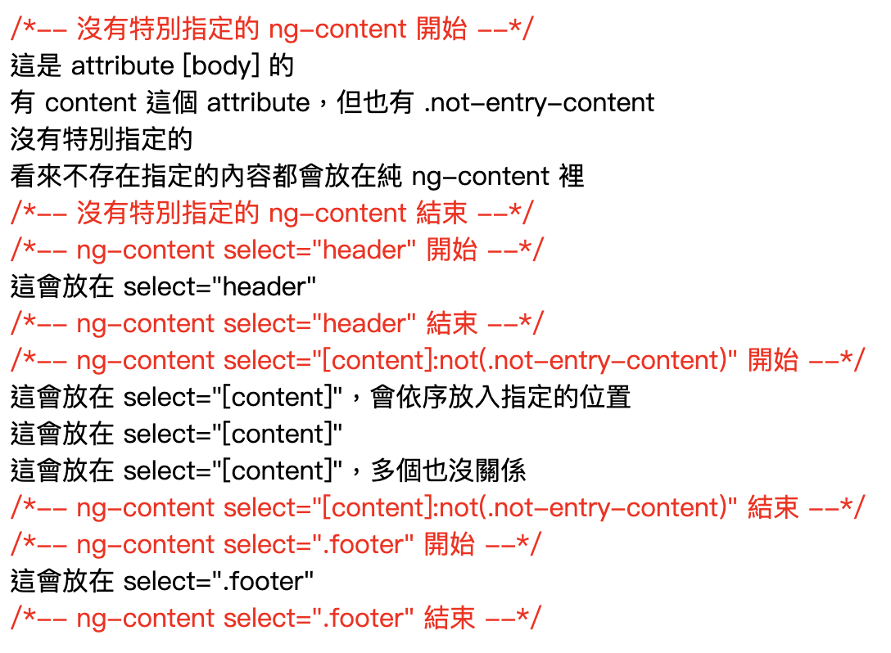

# 範本參考變數及頁面範本

## 範本參考變數

在 `Template` 的 `HTML` 標籤套用範本變數的語法( `#name` ) 來宣告。

```html
<input type="text" #input />
```

### 另一種寫法

範本變數的語法是 `#` ，也可以使用 `ref-` 來宣告範本變數

```html
<input type="text" ref-input />
```

### 在 `HTML` 使用

當宣告範本變數，如果 `HTML` 標籤的話。就代表是這個標籤的 DOM 物件。

```html
<input type="text" #input ngModel />
<div>{{ input.value }}</div>
```

:::tip
如果要雙向綁定，需要加上 `ngModel`，並引入 `FormsModule`
:::

### 在 `directive` 使用

當宣告範本變數為 `directive` 的話。就代表是這個該 Component ，可以存取該 Component 的 Property 。

```html input.component.html
<input type="text" [(ngModel)]="value" />
```

```typescript input.component.ts
value = "";
```

```html app.component.html
<app-input #input></app-input>
<div>{{ input.value }}</div>
```

:::danger
當然也可以透過範本參考變數來修改 Component 裡的值，但建議不要這樣做。<br />任務拆分清楚也方便日後的維護。
:::

## 頁面範本

### ng-container

[結構型指令](/docs/Angular/angular_directives#ngif)在同個 DOM 上只能使用一個的限制，而加上其他 HTML Tag 又會破壞原本的結構，可以使用 `ng-container`，不會渲染到畫面上破壞結構。

### ng-template

在頁面裡難免會遇到判斷該顯示哪個區塊，如果都在主要結構裡做 `ngIf` 或是 `ngSwitch` 的判斷，又包含著該區塊要顯示的 HTML ，或是這裡面又有些重複的 HTML，那頁面會變成太雜亂難維護。<br />利用 `ng-template` ，把該顯示的資料獨立出來，利於方便管理及後續的維護。

#### ngTemplateOutlet

利用範本參考變數和搭配 `ngTemplateOutlet` 來指定要顯示的區塊。<br />
使用 `ngTemplateOutletContext` 來帶入資料讓 `ng-template` 有夠多的彈性。<br />
`ngTemplateOutletContext` 預設有個 `$implicit` 可使用，當 `ng-template` 宣告變數去接傳入的值，只要單純地宣告變數就會直接帶入 `$implicit`，不用額外去指定。<br />
也可以使用[結構型指令來宣告 ngTemplateOutlet](/docs/Angular/angular_directives#ngtemplateoutlet)。

```html
<ng-container
  [ngTemplateOutlet]="data.length ? hasData : empty"
  [ngTemplateOutletContext]="{implicit: abc, name: 123}"
></ng-container>
<ng-template #hasData let-value let-data="name">
  有資料時會顯示，也會顯示傳入的值： {{ value }}, {{ data }}
</ng-template>
<ng-template #empty> 當資料是空的時候顯示這個 </ng-template>
```

### ng-content

Angular 可以建立一個頁面範本，利用 `ng-content` 做預留的空間，讓父元件可以放入內容到指定的位置。<br />
`ng-content` 也可以指定 `select` 屬性，透過標籤、類別、屬性的方法到指定的 `ng-content` 裡。

```html title="child.component.html"
<div style="color: red;">/*-- 沒有特別指定的 ng-content 開始 --*/</div>
<ng-content></ng-content>
<div style="color: red;">
  /*-- 沒有特別指定的 ng-content 結束，ng-content select="header" 開始 --*/
</div>
<ng-content select="header"></ng-content>
<div style="color: red;">
  /*-- ng-content select="header" 結束，ng-content select="[content]" 開始 --*/
</div>
<ng-content select="[content]"></ng-content>
<div style="color: red;">
  /*-- ng-content select="[content]" 結束，ng-content select=".footer" 開始 --*/
</div>
<ng-content select=".footer"></ng-content>
<div style="color: red;">/*-- ng-content select=".footer" 結束 --*/</div>
```

```html title="parent.component.html"
<app-child>
  <div class="footer">這會放在 select=".footer"</div>
  <header>這會放在 select="header"</header>
  <div body>這是 attribute [body] 的</div>
  <div content>這會放在 select="[content]"，會依序放入指定的位置</div>
  <div content>這會放在 select="[content]"</div>
  <div>沒有特別指定的</div>
  <div content>這會放在 select="[content]"，多個也沒關係</div>
  <div>看來不存在指定的內容都會放在純 ng-content 裡</div>
</app-child>
```



## Reference

> [Angular 開發實戰：從零開始](https://www.udemy.com/course/angular-zero/) <br />
