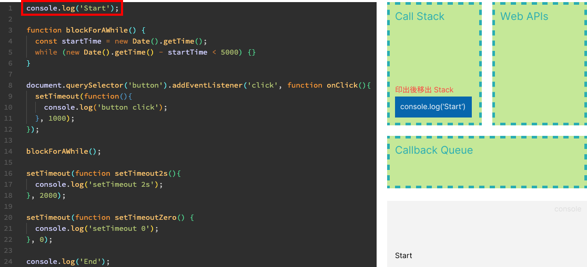
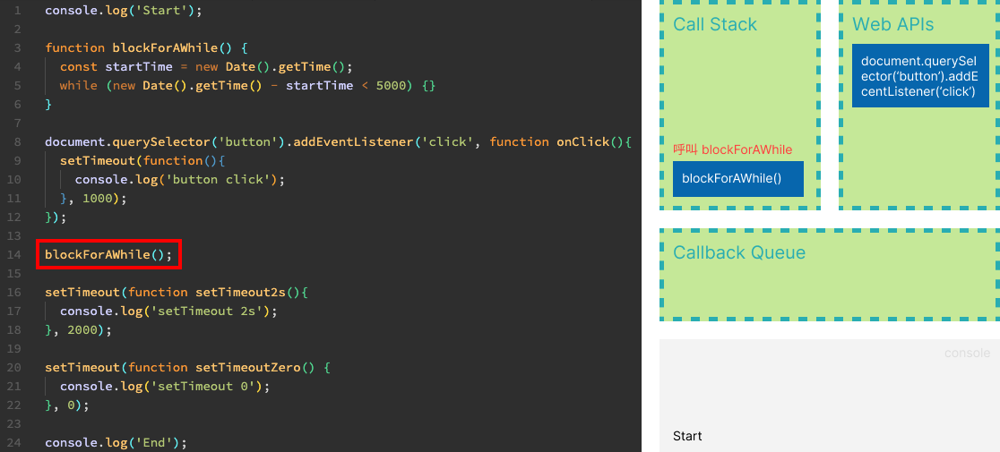
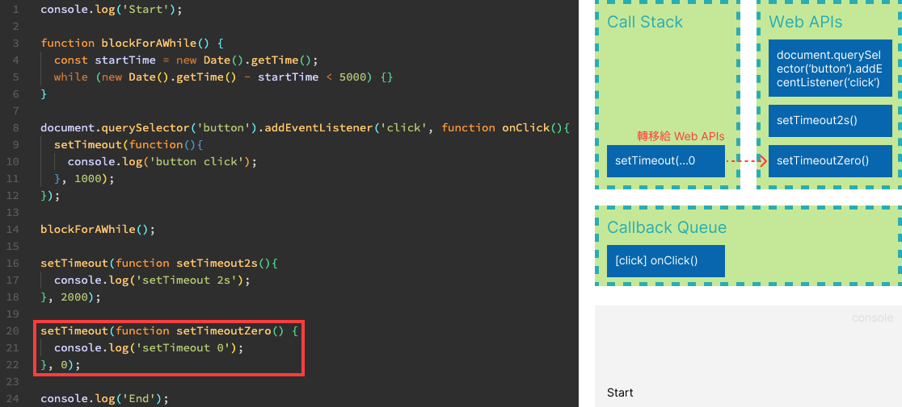

# JavaScript 的那些觀念

## 直譯式語言

`JavaScript` 是直譯式的語言，它不經過編譯，而是直接使用直譯器解析後，直接放到環境執行。優點是彈性較大。<br />
[了解 `JavaScript` 的直譯器如何解析](https://esprima.org/index.html)

## RHS (Right-hand side)

取值來自右邊的變數上。

## LHS (Left-hand side)

賦予值到左邊的變數上。

## 立即函式(Immediately-Invoked Function Expression, IIFE)

```javascript
(function () {})();
```

## 函式陳述式

```javascript
function fn() {}
// 函式陳述式又為具名函式
```

## 函式表達式

```javascript
const fn = function () {};
// 函式表達式又為匿名函式
```

:::note
依照 JavaScript 特性來看，函式陳述式會被 Hoisting，而函式表達式則是變數先被建立，再被賦予函式。
:::

## 作用域控制

```javascript
// 因為 block({}) 的關係，a 不會互相影響到
{
  const a = 1;
}
{
  const a = 2;
}
```

```javascript
var name = "Hsing";
function sayHi() {
  var name = "Chen";
  name = "Hsing Chen";
}
sayHi();
console.log(name); // 'Hsing'
// 如果 sayHi() 沒有 var ，則會是 'Hsing Chen'
```

當 `sayHi()` 裡的 `name`，有宣告，其作用域是在 scope 裡並不會影響到外面的 `name`。<br />
而如果 `sayHi()` 的 `name` 是直接賦予值，則會改變。

## 連續賦值

```javascript
const obj = {
  value: 1,
};
Object.defineProperty(obj, "value", {
  writable: false,
});
const b = (obj.value = 3);
/*
等號運算子會回傳一個結果
> obj.value = 3，雖然obj.value不會被覆寫，但等號運算子會回傳3，3再賦值給b，所以b=3
*/
```

:::danger
並不推薦使用連續賦值
:::

## 運算子優先順序

可參考 [MDN 上的運算子優先序](https://developer.mozilla.org/zh-TW/docs/Web/JavaScript/Reference/Operators/Operator_precedence#%E8%A1%A8%E6%A0%BCtable)

當優先順序相等，就會依照相依性來處理先後順序

```javascript
const a = 1 + 2 * 3;
/*
1. 2 * 3
2. 1 + 6
3. 由右至左賦予a
*/

console.log(1 > 2 > 3); // false
/*
1. 1 > 2 = false
2. false > 3 = false
*/

console.log(3 < 2 < 1); // true
/*
1. 3 < 2 = false
2. false(轉型為0) < 1 = true
*/
```

## 相等與不相等

### 嚴格相等、不相等

`===` || `!==`<br />
可以除了判斷數值之外，也會判斷型別是否相同來回傳 `true` || `false`。

```javascript
// 一些特殊的情況
console.log(NaN === NaN); // false
console.log(-0 === +0); // true
```

### 寬鬆相等、不相等

`==` || `!=`<br />
**布林與字串會被轉換成數字型別**，但 `Null` 和 `undefined` 不會被轉為數字型別。

```javascript
console.log(true == "true"); // false, Number('true') 會回傳 NaN
console.log(Number(null)); // 0
console.log(null == 0); // false, null 在寬鬆相等不會被轉為數字型別
console.log(null == undefined); // true, null 跟 undefined 在寬鬆相等是一致的
```

物件與非物件，會用包裹物件做轉換。

```javascript
console.log(Number([10])); // 10
console.log(String(["A"])); // A
```

物件與物件比對，是比對參考位置。

```javascript
console.log({} == {}); // false
console.log([] == []); // false
```

## Event loop (事件循環)

[Event Loop 的視覺化呈現](http://latentflip.com/loupe/)

Event Loop 的任務是如果 `Stack` 是空的，就把 `Queue` 中的 frame 放到 `Stack` 中，直到 `Stack` 和 `Queue` 都是空的為止。

### 流程描述

當頁面載入，`JavaScript Runtime` 時，會依照撰寫的 `JavaScript` ，由上到下依序執行下來，一個程式碼片段視為一個 frame，會先放入 `Call Stack`。<br />
如果是 `XMLHttpRequest`、`Timer`、`Event Listener`，則這些 frame 會從 `Stack` 先移到 `Web APIs` ，並繼續執行 `Stack` 裡的程式碼片段。<br />
然而如果在 `Stack` 裡的程式碼因為等待時間過久，則會造成 `blocking`。<br />
當 `Stack` 清空後， `Event loop` 會將 `Web APIs` 處理完，放入 `Queue` 的 frame 移至 `Stack` 裡去執行。<br />
直到 `Stack` 和 `Queue` 都為空。

### 各作用解釋

#### 單一執行緒 (single-threaded)

JavaScript 是單一執行緒，顧名思義就是一個時間點只能做一件事。

#### 堆疊 (Stack)

1. 後進先出 (Last In, First Out，LIFO)
2. 每次呼叫一個函式，該函式會被堆疊到最頂端；當執行完畢時，該函式會從堆疊中移出。

#### Web APIs

當 Web APIs 有事件完成後，則會將 frame 移至 Queue。<br />
主要任務有：

1. 發送網路請求 (XMLHttpRequest)
2. 計時器 (Timer)
3. 事件處理 (Event Listener)

#### 佇列 (Queue)

1. 先進先出 (First In, First Out，FIFO)
2. 管理非同步任務。例如： setTimeout 、 ajax

前面有提到，當 `Stack` 沒有 frame 時， `Event loop` 會從 `Queue` 的 frame 移至 `Stack` 執行。<br />
由此我們知道，例如當 Web APIs 在 `setTimeout` 所設定的秒數後，將其內容放入 `Queue`。不是秒數到就**立即執行**，而是**即將被執行**

#### 阻塞 (blocking)

阻塞通常發生在**同步**的操作上。<br />
當 `JavaScript Runtime` 時，會執行在 `Stack` 裡的程式碼片段。<br />
而萬一程式碼片段執行時間過久，其他任務無法被執行，進而造成瀏覽器停止渲染，使用者感受到卡頓或凍結。造成瀏覽體驗不佳。

### 工作描述

當頁面載入，瀏覽器的 `JavaScript` 引擎會依照撰寫的程式碼，由上到下依序執行下來。<br />
一個程式碼片段視為一個 frame，會先放入 `Call Stack` 做執行。<br />
當 `Stack` 遇到像是 `XMLHttpRequest`、`Timer`、`Event Listener`，這些 frame 會從 `Stack` 先移到 `Web APIs` ，並繼續執行 `Stack` 裡的程式碼片段。<br />
萬一有 frame 在 `Stack` 裡因程式碼邏輯導致執行過久，則會造成 `blocking` 。<br />
**當 `Stack` 清空後， `Event loop` 會將 `Web APIs` 處理完，放入 `Queue` 的 frame 移至 `Stack` 裡去執行**。<br />
**直到 `Stack` 和 `Queue` 都為空**。

### 範例

```javascript
console.log("Start");

function blockForAWhile() {
  const startTime = new Date().getTime();
  while (new Date().getTime() - startTime < 5000) {}
}

document.querySelector("button").addEventListener("click", function onClick() {
  setTimeout(function () {
    console.log("button click");
  }, 1000);
});

blockForAWhile();
// 執行 blockForAWhile() 時，按下 button

setTimeout(function setTimeout2s() {
  console.log("setTimeout 2s");
}, 2000);

setTimeout(function setTimeoutZero() {
  console.log("setTimeout 0");
}, 0);

console.log("End");

/* 最後輸出的 log
Start
End
setTimeout 0
button click
setTimeout 2s
*/
```

#### 圖解

1. 印出 Start
   <br />
2. button 監聽事件轉交 Web APIs
   <br />
3. 執行 blockForWhile()
   <br />
4. 模擬 blocking，並按下 button 觸發事件
   <br />
5. 遇到 setTimeout，轉交 Web APIs
   <br />
6. 模擬遇到秒數為 0 的 setTimeout
   <br />
7. 印出 End
   <br />
8. Stack 無 frame，從 Queue 拿 frame 來執行
   <br />
9. setTimeout 跑完丟到 Queue，再被 Event Loop 拉至 Stack 執行
   
   
   

## Reference

> [六角學院 - JavaScript 心機文法篇 - JS 面試常見核心知識](https://www.youtube.com/watch?v=8U5kbb1SvJg)<br /> > [MDN - 語句和聲明](https://developer.mozilla.org/en-US/docs/Web/JavaScript/Reference/Statements)<br /> > [MDN - 運算子優先順序](https://developer.mozilla.org/en-US/docs/Web/JavaScript/Reference/Operators/Operator_precedence)<br /> > [loupe - event loop](http://latentflip.com/loupe/)<br /> > [JavaScript Event Loop](https://www.javascripttutorial.net/javascript-event-loop/)
