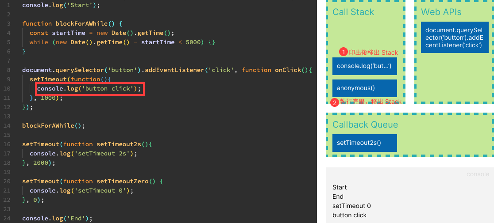

# Event loop (事件循環)

[Event Loop 的視覺化呈現](http://latentflip.com/loupe/)

Event Loop 的任務是如果 `Stack` 是空的，就把 `Queue` 中的 frame 放到 `Stack` 中，直到 `Stack` 和 `Queue` 都是空的為止。


## 流程描述

當頁面載入，`JavaScript Runtime` 時，會依照撰寫的 `JavaScript` ，由上到下依序執行下來，一個程式碼片段視為一個 frame，會先放入 `Call Stack`。<br />
如果是 `XMLHttpRequest`、`Timer`、`Event Listener`，則這些 frame 會從 `Stack` 先移到 `Web APIs` ，並繼續執行 `Stack` 裡的程式碼片段。<br />
然而如果在 `Stack` 裡的程式碼因為等待時間過久，則會造成 `blocking`。<br />
當 `Stack` 清空後， `Event loop` 會將 `Web APIs` 處理完，放入 `Queue` 的 frame 移至 `Stack` 裡去執行。<br />
直到 `Stack` 和 `Queue` 都為空。

## 各作用解釋

### 單一執行緒 (single-threaded)

JavaScript 是單一執行緒，顧名思義就是一個時間點只能做一件事。

### 堆疊 (Stack)

1. 後進先出 (Last In, First Out，LIFO)
2. 每次呼叫一個函式，該函式會被堆疊到最頂端；當執行完畢時，該函式會從堆疊中移出。

### Web APIs

當 Web APIs 有事件完成後，則會將 frame 移至 Queue。<br />
主要任務有：

1. 發送網路請求 (XMLHttpRequest)
2. 計時器 (Timer)
3. 事件處理 (Event Listener)

### 佇列 (Queue)

1. 先進先出 (First In, First Out，FIFO)
2. 管理非同步任務。例如： setTimeout 、 ajax

前面有提到，當 `Stack` 沒有 frame 時， `Event loop` 會從 `Queue` 的 frame 移至 `Stack` 執行。<br />
由此我們知道，例如當 Web APIs 在 `setTimeout` 所設定的秒數後，將其內容放入 `Queue`。不是秒數到就**立即執行**，而是**即將被執行**

### 阻塞 (blocking)

阻塞通常發生在**同步**的操作上。<br />
當 `JavaScript Runtime` 時，會執行在 `Stack` 裡的程式碼片段。<br />
而萬一程式碼片段執行時間過久，其他任務無法被執行，進而造成瀏覽器停止渲染，使用者感受到卡頓或凍結。造成瀏覽體驗不佳。

## 範例

當頁面載入，瀏覽器的 `JavaScript` 引擎會依照撰寫的程式碼，由上到下依序執行下來。<br />
一個程式碼片段視為一個 frame，會先放入 `Call Stack` 做執行。<br />
當 `Stack` 遇到像是 `XMLHttpRequest`、`Timer`、`Event Listener`，這些 frame 會從 `Stack` 先移到 `Web APIs` ，並繼續執行 `Stack` 裡的程式碼片段。<br />
萬一有 frame 在 `Stack` 裡因程式碼邏輯導致執行過久，則會造成 `blocking` 。<br />
**當 `Stack` 清空後， `Event loop` 會將 `Web APIs` 處理完，放入 `Queue` 的 frame 移至 `Stack` 裡去執行**。<br />
**直到 `Stack` 和 `Queue` 都為空**。

```javascript
console.log("Start");

function blockForAWhile() {
  const startTime = new Date().getTime();
  while (new Date().getTime() - startTime < 5000) {}
}

document.querySelector("button").addEventListener("click", function onClick() {
  setTimeout(function () {
    console.log("button click");
  }, 1000);
});

blockForAWhile();
// 執行 blockForAWhile() 時，按下 button

setTimeout(function setTimeout2s() {
  console.log("setTimeout 2s");
}, 2000);

setTimeout(function setTimeoutZero() {
  console.log("setTimeout 0");
}, 0);

console.log("End");

/* 最後輸出的 log
Start
End
setTimeout 0
button click
setTimeout 2s
*/
```

### 圖解

1. 印出 Start
   <br />
2. button 監聽事件轉交 Web APIs
   <br />
3. 執行 blockForWhile()
   <br />
4. 模擬 blocking，並按下 button 觸發事件
   <br />
5. 遇到 setTimeout，轉交 Web APIs
   <br />
6. 模擬遇到秒數為 0 的 setTimeout
   <br />
7. 印出 End
   <br />
8. Stack 無 frame，從 Queue 拿 frame 來執行
   <br />
9. setTimeout 跑完丟到 Queue，再被 Event Loop 拉至 Stack 執行
   
   
   

## Reference

> [loupe - event loop](http://latentflip.com/loupe/)<br /> > [JavaScript Event Loop](https://www.javascripttutorial.net/javascript-event-loop/)
