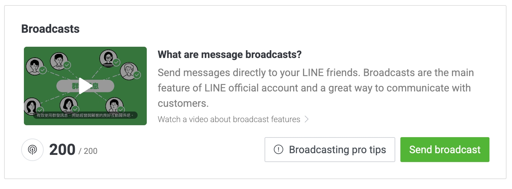

# 這個網站的誕生

看到[PJ 大的未整理筆記](https://pjchender.dev/)，被版面的配置和功能所吸引，所以也決定來搞一個。<br />
這網站目的主要是有個空間可以放學習的筆記之外，預防往後工作可能遇到問題，卻忘記曾經學過的東西該如何使用，利用這網站的筆記來喚醒那個沈睡太久(或是消失)的記憶。<br />
我打算把文件放到自己的 GitHub 上，當 push 時幫我部署到 GitHub Pages，嗯...潮一點再推播到 LINE 上面通知網站更新 😎

## 安裝

依照[官網](https://docusaurus.io/docs/installation)的步驟<br/>
在目錄的資料夾來執行安裝的指令

```powershell
npx create-docusaurus@latest <WebsiteName> classic
```

安裝完後利用指令到建立的資料夾後將網站 run 起來，預設是 `http://localhost:3000`

---

## 設定 docusaurus.config

```javascript title="./docusaurus.config.js"
const config = {
  // 網站的title
  title: "Hsing 站在巨人肩膀的學習筆記",
  // 副標題，不過如果沒有要使用它預設的landing page，其實也不會顯示
  tagline: "寫給未來那個有點印象但記不起來的自己",
  // 這邊因為我是要用 GitHub Pages
  url: "https://hsing0224.github.io/",
  // 儲存庫名稱，
  baseUrl: "/titan-shoulders/",
  i18n: {
    defaultLocale: "zh-Hant",
    locales: ["zh-Hant"],
  },
  deploymentBranch: "gh-pages",
  presets: [
    [
      // ...
      {
        docs: {
          // ...
          // 設定這個，在文章頁面按下編輯此頁連結，可以到該頁編輯
          editUrl: "https://github.com/Hsing0224/titan-shoulders/tree/master/",
        },
        // 目前還沒要用，先關閉
        blog: false,
        // ...
      },
    ],
  ],
  themeConfig:
    // ...
    {
      navbar: {
        // 導覽列logo旁的文字
        title: "Hsing",
        items: [
          // 設定連結、文字、定位
          { to: "/docs/intro", label: "Notes", position: "left" },
        ],
      },
      // ...
    },
};
```

## 隱藏預設的 landing page，直接幫我導到文章首頁

將內容替換成

```javascript title="./src/pages/index.js"
export default function Home() {
  return <Redirect to="docs/intro" />;
}
```

## GitHub 的設定

### 設定 GitHub Pages

GitHub 開好 repository 後，建立一個 gh-pages 分支，在**專案內**的 **settings > Pages**，把預設的 master 改為 gh-pages

### 設定 GitHub Actions

先到**自己帳號(右上角頭像)**的 **settings**，**Developer Settings > Personal access tokens > Tokens(classic)**，點選 **Generate new token > Generate new token(classic)**，幫 Token 取個名稱識別，**Expiration** 選擇這個 token 的有效期限，表格勾選這個 token 的權限(只有部署用，repo 全開即可)。<br />
按下 Generate token 後即可得到 token。

:::danger
此 token 只會顯示在按下後的頁面，之後將不會出現
:::

到專案下的 settings，**Secrets and variables > Actions**，按下 **New repository secret** 把剛剛的 token 新增到專案使用。

:::note
這邊的 Name，呼叫這個 token 會使用到，嗯...我是照大家一樣都打大寫
:::

### 設定 .yml

在專案的目錄下新增一個資料夾 **.github > workflows**，或是專案的 Actions 的 **set up a workflow yourself**，新增一個 .yml 檔案

```yml
name: Deploy to GitHub Pages

on:
  push:
    branches:
      - master

jobs:
  deploy:
    name: Deploy to GitHub Pages
    runs-on: ubuntu-latest
    steps:
      - uses: actions/checkout@v2
      - uses: actions/setup-node@v2
        with:
          node-version: 16.x
          cache: "npm"

      - name: Install dependencies
        run: npm install
      - name: Build website
        run: npm run build

      - name: Deploy to GitHub Pages
        uses: peaceiris/actions-gh-pages@v3
        with:
          github_token: ${{ secrets.<剛剛建立token的Name> }}
          publish_dir: ./build
```

## LINE Message API

### 建立 LINE

建立一個 [LINE 官方帳號](https://entry.line.biz/form/entry/unverified)<br />
稍後再進行官方認證，將帳號先建立起來。之後會跳轉到管理介面。<br />

:::tip
可以從此區域得知目前還剩下多少推播的額度。

❗️ 當推播對象為群組，一則的額度計算為 1 \* 群組人數
:::

### 開啟 Message API

在功能列最右方的 Setting，可以進入 Account settings。除了更改個人頭像外，左側選單有個 **Message API**。將其開啟。<br />
這邊會需要你選擇 provider，可以選擇或建立一個新的 provider，沒有什麼差別，一路確定後即可開啟 Message API 的功能。<br />
當開啟後會看到頻道的資訊，這邊可以拿到我們推播時需要的 **channel secret**<br />
也可以從下方的 **You can find more related settings in the LINE Developers Console.** 連至[開發者頁面](https://developers.line.biz/console/)<br />

### 創建 Channel access token

從開發者頁面，選取剛剛的 provider 後，即可找到創立的帳號。在此我們需要開啟 **Channel access token**。<br />
按下 issue 即可發布且顯示該 token。

:::tip
如果 token 有更新的需求，則可以按下 Reissue，重新再產生一組新的 token
:::

### 設定 deploy

在 github action 推播的所需資訊

- Channel secret
- Channel access token

參照 [LINE Developers Document 的 Message API](https://developers.line.biz/en/reference/messaging-api/#send-push-message) <br />
將推播的所需格式填入對應的資訊。

```yml
- name: Send LINE Message API
  env:
    CHANNEL_ACCESS_TOKEN: ${{ secrets.CHANNEL_ACCESS_TOKEN }} # LINE Messaging API 的存取權杖
    GITHUB_ACTOR: ${{ github.actor }} # 哪位使用者觸發了這次部署
    LINE_ID: ${{ secrets.LINE_ID }} # 要推播的 LINE ID
  run: |
    json_payload='{
      "to": "'"${LINE_ID}"'",
      "messages": [
        {
          "type": "text",
          "text": "因為 '"${GITHUB_ACTOR}"' 的餵食，Docusaurus 又長大了"
        }
      ]
    }'
    curl -v -X POST https://api.line.me/v2/bot/message/push \
    -H "Content-Type: application/json" \
    -H "Authorization: Bearer $CHANNEL_ACCESS_TOKEN" \
    -d "$json_payload"
```

:::tip
所傳入的 $json_payload 內容都為字串。如需要斷行，則可以在 yml 使用 **\n**
:::

## LINE notify

:::danger
LINE 官方在 2025/3/31 關閉 LINE notify 服務，可改用 LINE Message API 來處理訊息推播(每個月 200 則免費)
:::

前往 [LINE notify](https://notify-bot.line.me/zh_TW/)，登入後，**右上角點 自己名稱 > 個人頁面**，按下發行權仗。<br />
<br />
整個訊息的架構為【權杖名稱】 + 設定的訊息

```yml
# 發送 LINE Notify 通知
- name: Send LINE Notify
  env:
    LINE_NOTIFY_TOKEN: ${{ secrets.LINE_NOTIFY_TOKEN }} # LINE notify 的存取權杖
    GITHUB_ACTOR: ${{ github.actor }} # 哪位使用者觸發了這次部署
  run: |
    curl -X POST https://notify-api.line.me/api/notify \
    -H "Authorization: Bearer $LINE_NOTIFY_TOKEN" \
    -F "message=因為$GITHUB_ACTOR的餵食，Docusaurus又長大了" \
    -F "stickerPackageId=11538" \
    -F "stickerId=51626498"
```
