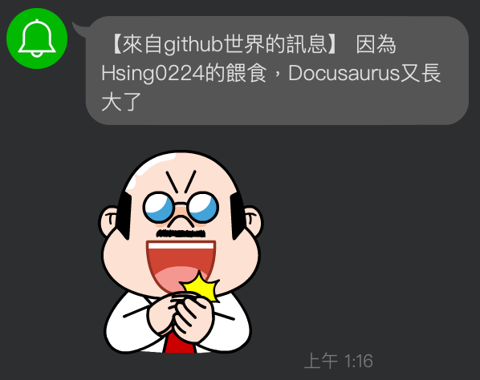

# 這個網站的誕生
看到[PJ大的未整理筆記](https://pjchender.dev/)，被版面的配置和功能所吸引，所以也決定來搞一個。<br />
這網站目的主要是有個空間可以放學習的筆記之外，預防往後工作可能遇到問題，卻忘記曾經學過的東西該如何使用，利用這網站的筆記來喚醒那個沈睡太久(或是消失)的記憶。<br />
我打算把文件放到自己的 GitHub 上，當push時幫我部署到 GitHub Pages，嗯...潮一點再推播到LINE上面😎

## 安裝
依照[官網](https://docusaurus.io/docs/installation)的步驟<br/>
在目錄的資料夾來執行安裝的指令
```powershell
npx create-docusaurus@latest <WebsiteName> classic
```
安裝完後利用指令到建立的資料夾後將網站run起來，預設是`http://localhost:3000`

---

## 設定docusaurus.config

```javascript title="./docusaurus.config.js"
const config = {
  // 網站的title
  title: '站在巨人肩膀的學習筆記',
  // 副標題，不過如果沒有要使用它預設的landing page，其實也不會顯示
  tagline: '寫給未來那個有點印象但記不起來的自己',
  // 這邊因為我是要用 GitHub Pages
  url: 'https://hsing0224.github.io/',
  // 儲存庫名稱，
  baseUrl: '/titan-shoulders/',
  i18n: {
    defaultLocale: 'zh-Hant',
    locales: ['zh-Hant'],
  },
  deploymentBranch: 'gh-pages',
  presets: [
    [
      // ...
      ({
        docs: {
          // ...
          // 設定這個，在文章頁面按下編輯此頁連結，可以到該頁編輯
          editUrl:
            'https://github.com/Hsing0224/titan-shoulders/tree/master/',
        },
        // 目前還沒要用，先關閉
        blog: false,
        // ...
      }),
    ],
  ],
  themeConfig:
    // ...
    ({
      navbar: {
        // 導覽列logo旁的文字
        title: 'Hsing',
        items: [
          // 設定連結、文字、定位
          { to: '/docs/intro', label: 'Notes', position: 'left' },
          
        ],
      },
      // ...
    }),
}
```
## 隱藏預設的landing page，直接幫我導到文章首頁
將內容替換成
```javascript  title="./src/pages/index.js"
export default function Home() {
  return <Redirect to='docs/intro' />;
}
```

## GitHub 的設定
### 設定 GitHub Pages
GitHub 開好repository後，建立一個`gh-pages`分支，在**專案內**的`settings > Pages`，把預設的`master`改為`gh-pages`
### 設定Github Actions
先到**自己帳號(右上角頭像)**的`settings`，`Developer Settings > Personal access tokens > Tokens(classic)`，點選`Generate new token > Generate new token(classic)`，幫Token取個名稱識別，`Expiration`選擇這個token的有效期限，表格勾選這個token的權限(只有部署用，`repo全開即可`)。<br />
按下`Generate token`後即可得到token，
:::danger
此token只會顯示在按下後的頁面，之後將不會出現
:::
到**專案內**的`settings`，`Secrets and variables > Actions`，按下`New repository secret`把剛剛的token新增到專案使用。
:::caution
這邊的`Name`，呼叫這個token會使用到，嗯...我是照大家一樣都打大寫
:::
### 設定.yml
在專案的目錄下新增一個資料夾`.github` > `workflows`，(或是專案的`Actions`的`set up a workflow yourself`)，新增一個.yml檔案
```yml
name: Deploy to GitHub Pages

on:
  push:
    branches:
      - master

jobs:
  deploy:
    name: Deploy to GitHub Pages
    runs-on: ubuntu-latest
    steps:
      - uses: actions/checkout@v2
      - uses: actions/setup-node@v2
        with:
          node-version: 16.x
          cache: 'npm'

      - name: Install dependencies
        run: npm install
      - name: Build website
        run: npm run build

      - name: Deploy to GitHub Pages
        uses: peaceiris/actions-gh-pages@v3
        with:
          github_token: ${{ secrets.<剛剛建立token的Name> }}
          publish_dir: ./build
```
## LINE notify
前往[LINE notify](https://notify-bot.line.me/zh_TW/)，登入後，右上角點`自己名稱 > 個人頁面`，按下`發行權仗`。<br />
<br />
整個訊息的架構為【權杖名稱】 + 設定的訊息

```yml
      # 發送 LINE Notify 通知
      - name: Send LINE Notify
        env:
          LINE_NOTIFY_TOKEN: ${{ secrets.LINE_NOTIFY_TOKEN }} # 使用之前設定的 Secrets
          GITHUB_ACTOR: ${{ github.actor }} # 使用之前設定的 Secrets
        run: |
          curl -X POST https://notify-api.line.me/api/notify \
          -H "Authorization: Bearer $LINE_NOTIFY_TOKEN" \
          -F "message=因為$GITHUB_ACTOR的餵食，Docusaurus又長大了" \
          -F "stickerPackageId=11538" \
          -F "stickerId=51626498"
```