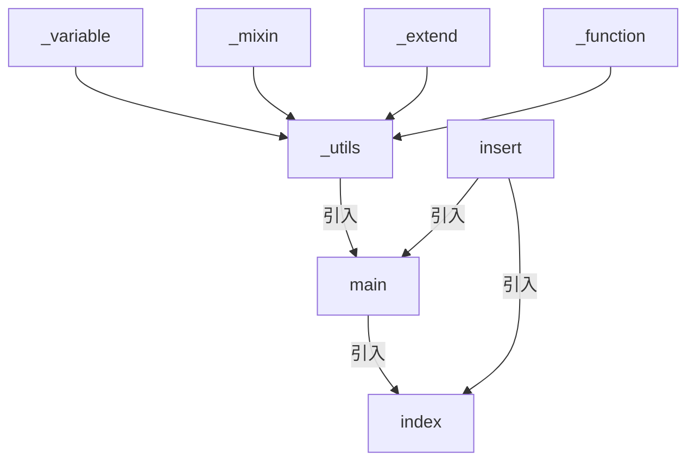

# SCSS 檔案引入

在專案開發上，會依不同職責劃分各個 SCSS 檔案。<br />
最終再利用引入的方式將所需的 SCSS 檔案匯集起來。<br />
SCSS 檔案引入有三種相關的方式，分別是 `@import`、`@forward`、`@use`。

:::note

- 檔名為 `_`，不會被編譯成實體的檔案
- 引入時可以不用寫副檔名

:::

## 寫在前面的結論

|              | @import | @forward |   @use   |
| :----------: | :-----: | :------: | :------: |
|    作用域    |  全局   | 自身檔案 | 自身檔案 |
| 隨意位置引入 |   ✅    |    ❌    |    ❌    |
|  程式碼覆蓋  |   ✅    |    ❌    |    ❌    |
|  程式碼重複  |   ✅    |    ❌    |    ❌    |
|    配置性    |   ❌    |    ❌    |    ✅    |

## 範例檔案

```scss title="_variable.scss"
$primary-color: red;
$secondary-color: green !default;
$third-color: blue;
```

```scss title="_mixin.scss"
@mixin square($value) {
  width: $value;
  height: $value;
}
@mixin is-hide {
  display: none;
}

@mixin is-show {
  display: block;
}
```

```scss title="_extend.scss"
%list-reset {
  list-style: none;
  margin: 0;
  padding: 0;
}

%button-default {
  padding: 0;
  background-color: transparent;
  border: none;
  cursor: pointer;
}
```

```scss title="_function.scss"
@function calculate-rem($px, $base-font-size: 16px) {
  @return calc($px / $base-font-size) * 1rem;
}

@function pow($number, $exponent) {
  $result: 1;
  @for $i from 1 through $exponent {
    $result: $result * $number;
  }
  @return $result;
}
```



多增加一個 insert 的檔案來測試重複載入

```scss title="insert.scss"
@import "variable";

.insert {
  color: $primary-color;
}
```

## @import

該 SCSS 使用 `@import` 引入時，也會一併將該 SCSS 裡所 `@import` 的 SCSS 引入。<br />

:::danger
官網已經將 `@import` 標註為棄用。
:::

```scss title="_utils.scss"
@import "variable";
@import "mixin";
@import "extend";
@import "function";
```

```scss title="main.scss"
@import "utils";
@import "insert";
```

```scss title="index.scss"
@import "main";

.base-font-size {
  font-size: calculate-rem(16px);
}

.color-primary {
  color: $primary-color;
}
.color-secondary {
  color: $secondary-color;
}

// 這裡又引入了 insert。模擬重複引入
@import "insert";

.box {
  @include square(50px);
  @include is-show;
}

.button-primary {
  color: $primary-color;
  @extend %button-default;
}
.button-secondary {
  color: $secondary-color;
  @extend %button-default;
}
```

編譯後

```css index.css
.button-secondary,
.button-primary {
  padding: 0;
  background-color: transparent;
  border: none;
  cursor: pointer;
}

.insert {
  color: red;
}

.base-font-size {
  font-size: 1rem;
}

.color-primary {
  color: red;
}

.color-secondary {
  color: green;
}

/* 這裡因為重複引入了 insert */
.insert {
  color: red;
}

.box {
  width: 50px;
  height: 50px;
  display: block;
}

.button-primary {
  color: red;
}

.button-secondary {
  color: green;
}
```

## @forward

引入檔案會有兩種使用的情境。

- 只引入檔案的樣式：<br />直接使用 `@forward`。
- 引入後要使用到該檔案的變數等功能：<br />無法直接使用 `@forward`，需搭配 `@use` 使用。

:::note
**as**, **show**, **hide**, **with**，皆無法用在 extend 的設定上。
:::

### as

將變數值加上前綴<br />
可以利用 `as` 來將命名作為轉換，當引入檔案使用，則會依照 `as` 後的名稱去呼叫變數等方法。<br />
`*` 來表示該檔案裡各個命名。

:::tip

- 變數: 以 `as var-*` 為例，正確寫法為 `$var-xxxxx`
- extend: 無需使用前綴，即便取了前綴也無法套用。
- `*` 需放在結尾
  :::

```scss title="_utils.scss"
@forward "variable" as var-*; // 使用 * 將檔案內各項名稱
@forward "mixin" as mixin*; // 也可以不打 dash，只是會很醜
@forward "extend" as extend-*; // extend 使用別名是無效的
// This will error
@forward "function" as *; // 這樣是不允許的，有寫跟沒寫一樣，這邊使用 fn-*
```

```scss title="main.scss"
@use "main";
@forward "insert"; // insert 在 @forward 無法從中插入

.base-font-size {
  font-size: main.fn-calculate-rem(16px);
}

.color-primary {
  // This will error
  color: main.var-$primary-color; // 前綴會針對名稱，變數符號 ($) 須在最前面
  color: main.$var-primary-color;
}
.color-secondary {
  color: main.$var-secondary-color;
}

.box {
  @include main.mixinsquare(50px);
}

.button-primary {
  color: main.$var-primary-color;
  @extend %button-default; // extend 因編譯機制和功能性，不用額外的別名
}
.button-secondary {
  color: main.$var-secondary-color;
  // This will error
  @extend %extend-button-default
      !optional; // 可使用 !optional 來避免編譯錯誤而中斷編譯
  // This will error
  @extend extend-%button-default;
}
```

### show

可以限制只想要被取用的

### hide

讓引入的檔案除了指定隱藏的值之外，其餘皆可使用。

```scss title="_utils.scss"
@forward "variable" as var-* show $var-primary-color, $var-third-color; // 當有別名的時候， show 及 hide 就需遵守命名規範
@forward "mixin" as mixin-* hide mixin-is-hide;
// This will error
@forward "extend" show %list-reset; // `@forward` 無法指定 show / hide 去指定 extend 的設定
@forward "function" as fn-* hide fn-calculate-rem;
```

:::danger
`@forward` 無法使用 show / hide 去指定 extend 的設定
:::

```scss title="main.scss"
@use "main";
@forward "insert";

.base-font-size {
  //  This will error
  font-size: main.fn-calculate-rem(16px); // fn-calculate-rem 已隱藏
}

.color-primary {
  color: main.$var-primary-color;
}
.color-secondary {
  // This will error
  color: main.$var-secondary-color; // 沒有將 $var-secondary-color 設為 show 的一員
}

.box {
  @include main.mixin-square(50px);
  // This will error
  @include main.mixin-is-hide; // 已經 hide 所以找不到
}

.button-primary {
  color: main.$var-primary-color;
  @extend %button-default; // extend 因編譯機制和功能性，不用額外的別名
}
.button-secondary {
  color: main.$var-secondary-color;
  @extend %button-default;
}
```

### with

```scss title="_utils.scss"
@forward "variable" as var-* show $var-primary-color, $var-third-color with($secondary-color:
        blue !default);
```

當引入的檔案有設定 `!default` 時，即可使用 with 去設定變數，有幾項需注意的地方

- 須寫在所有設定的最後
- 當有設定前綴 (as) 時，with 裡面的變數是引用檔裡面的，故不用加上前綴
- 目前 (2024/12/11) vscode 的套件會顯示語法的錯誤，但仍是可以編譯和作用的。

## @use

- 有自己的命名空間
- 不會引入檔案本身的引入
- 只會編譯一次檔案，即便被多個引入
