# 檔案引入

在專案開發上，會依不同職責劃分各個 SCSS 檔案，最終再利用引入的方式將所需的 SCSS 檔案匯集起來。<br />
SCSS 檔案引入有三種相關的方式，分別是 `@import`、`@forward`、`@use`。

:::note

- 檔名前綴為 `_`，不會被編譯成實體的檔案
- 引入時可以不用寫副檔名

:::

## 寫在前面的結論

|              | @import | @forward |   @use   |
| :----------: | :-----: | :------: | :------: |
|    作用域    |  全局   |   全局   | 自身檔案 |
| 隨意位置引入 |   ✅    |    ❌    |    ❌    |
|  程式碼覆蓋  |   ✅    |    ❌    |    ❌    |
|  程式碼重複  |   ✅    |    ❌    |    ❌    |
|    配置性    |   ❌    |    ✅    |    ✅    |

- 🤐 作用域：變數影響的範圍
- 😈 隨意位置引入：在任何位置引入
- 🙃 程式碼覆蓋：variable、mixin、extend、function 命名一樣的狀況是否會覆蓋
- 🤬 程式碼重複：當重複引入檔案時是否會重複編譯
- 配置性：當 variable 使用 `!default`，可否利用 `with` 帶入的方式替換值

## 範例檔案

```scss title="_variable.scss"
$primary-color: red;
$secondary-color: green !default;
$third-color: blue;
```

```scss title="_mixin.scss"
@mixin square($value) {
  width: $value;
  height: $value;
}
@mixin is-hide {
  display: none;
}

@mixin is-show {
  display: block;
}
```

```scss title="_extend.scss"
%list-reset {
  list-style: none;
  margin: 0;
  padding: 0;
}

%button-default {
  padding: 0;
  background-color: transparent;
  border: none;
  cursor: pointer;
}
```

```scss title="_function.scss"
@function calculate-rem($px, $base-font-size: 16px) {
  @return calc($px / $base-font-size) * 1rem;
}

@function pow($number, $exponent) {
  $result: 1;
  @for $i from 1 through $exponent {
    $result: $result * $number;
  }
  @return $result;
}
```



```mermaid
graph TD
    A[_variable] --> E[_utils];
    B[_mixin] --> E[_utils];
    C[_extend] --> E[_utils];
    D[_function] --> E[_utils];
    E -- 引入 --> F[main];
    G[insert] -- 引入 --> F[main];
    G -- 引入 --> H[index];
    F -- 引入 --> H[index];
```

多增加一個 insert 的檔案來測試重複載入

```scss title="insert.scss"
$primary-color: black;
.insert {
  color: $primary-color;
}
```

## @import

最簡單且容易理解的引入方式；無額外設定，只需使用 `@import` 把整份檔案引入。

:::caution
方便但需注意的方法。<br />
在使用 `@import`，特性是會一併引入這支檔案裡印入的檔案。
:::

:::danger
官網已經將 `@import` 標註為棄用。
:::

```scss title="_utils.scss"
@import "variable";
@import "mixin";
@import "extend";
@import "function";
```

```scss title="main.scss"
@import "utils";
@import "insert";
@import "insert";
@import "insert";
@import "insert"; // 🤬 編譯後會有許多 insert 裡的實體樣式
```

```scss title="index.scss"
@import "main";

.base-font-size {
  font-size: calculate-rem(16px);
}

.color-primary {
  color: $primary-color; // 🙃 因為被 insert.scss 覆蓋，這邊值為 black
}
.color-secondary {
  color: $secondary-color; // 🤐 可以使用來自 _utils.scss 引入的 _variable.scss 變數
}

@import "insert"; // 😈 可隨意位置引入

.box {
  @include square(50px);
  @include is-show;
}

.button-primary {
  color: $primary-color;
  @extend %button-default;
}
.button-secondary {
  color: $secondary-color;
  @extend %button-default;
}
```

## @forward

會有兩種使用的情境。

- 只引入檔案的樣式：<br />直接使用 `@forward`。
- 引入後要使用到該檔案的變數等功能：<br />無法直接使用 `@forward`，需搭配 `@use` 使用。

:::note
**as**, **show**, **hide**, **with**，皆無法用在 extend 的設定上。
:::

### as

將變數值加上前綴<br />
可以利用 `as` 來將命名作為轉換，當引入檔案使用，則會依照 `as` 後的名稱去呼叫變數等方法。<br />
`*` 來表示該檔案裡各個命名。

:::tip

- 變數: 以 `as var-*` 為例，正確寫法為 `$var-xxxxx`
- extend: 無需使用前綴，即便取了前綴也無法套用。
- `*` 需放在結尾
  :::

```scss title="_utils.scss"
@forward "variable" as var-*; // 使用 * 將檔案內各項名稱
@forward "mixin" as mixin*; // 也可以不打 dash，只是會很醜
@forward "extend" as extend-*; // extend 使用別名是無效的
// This will error
@forward "function" as *; // 這樣是不允許的寫法，有寫跟沒寫一樣
@forward "function";
```

:::note
❗️ 引入時會檢查 main & insert 相關的引入檔案，編譯時因為範例裡 $primary-color 有重複導致中斷。<br />
所以 insert.scss 做個變更

```scss title="insert.scss"
@use "variable";
.insert {
  color: variable.$primary-color;
}
```

:::

```scss title="main.scss"
@use "main";
@forward "insert";
@forward "insert";
@forward "insert"; // 🤬 insert 在編譯時，實體的樣式只會編譯出一次

.base-font-size {
  font-size: main.calculate-rem(
    16px
  ); // 🤐 可以使用來自 _utils.scss 引入的 _function.scss 函式
}

.color-primary {
  // This will error
  color: main.var-$primary-color; // 前綴會針對名稱，變數符號 ($) 須在最前面
  color: main.$var-primary-color;
}
.color-secondary {
  color: main.$var-secondary-color;
}

.box {
  @include main.mixinsquare(50px);
}

// This will error
@forward "insert"; // 😈 insert 在 @forward 無法從中插入

.button-primary {
  color: main.$var-primary-color;
  @extend %button-default; // extend 因編譯機制和功能性，不用額外的別名
}
.button-secondary {
  color: main.$var-secondary-color;
  // This will error
  @extend %extend-button-default
      !optional; // 可使用 !optional 來避免編譯錯誤而中斷編譯
  // This will error
  @extend extend-%button-default;
}
```

### show

可以限制只想要被取用的

### hide

讓引入的檔案除了指定隱藏的值之外，其餘皆可使用。

```scss title="_utils.scss"
@forward "variable" as var-* show $var-primary-color, $var-third-color; // 當有別名的時候， show 及 hide 就需遵守命名規範
@forward "mixin" as mixin-* hide mixin-is-hide;
// This will error
@forward "extend" show %list-reset; // `@forward` 無法指定 show / hide 去指定 extend 的設定
@forward "function" as fn-* hide fn-calculate-rem;
```

:::danger
`@forward` 無法使用 show / hide 去指定 extend 的設定
:::

```scss title="main.scss"
@use "main";
@forward "insert";

.base-font-size {
  //  This will error
  font-size: main.fn-calculate-rem(16px); // fn-calculate-rem 已隱藏
}

.color-primary {
  color: main.$var-primary-color;
}
.color-secondary {
  // This will error
  color: main.$var-secondary-color; // 沒有將 $var-secondary-color 設為 show 的一員
}

.box {
  @include main.mixin-square(50px);
  // This will error
  @include main.mixin-is-hide; // 已經 hide 所以找不到
}

.button-primary {
  color: main.$var-primary-color;
  @extend %button-default; // extend 因編譯機制和功能性，不用額外的別名
}
.button-secondary {
  color: main.$var-secondary-color;
  @extend %button-default;
}
```

### with

```scss title="_utils.scss"
@forward "variable" as var-* show $var-primary-color, $var-third-color with($secondary-color:
        blue !default);
```

當引入的檔案有設定 `!default` 時，即可使用 with 去設定變數，有幾項需注意的地方

- 須寫在所有設定的最後
- 當有設定前綴 (as) 時，with 裡面的變數是引用檔裡面的，故不用加上前綴
- 目前 (2024/12/11) vscode 的套件會顯示語法的錯誤，但仍是可以編譯和作用的。

## @use

- 有自己的命名空間
- 不會引入檔案本身的引入
- 只會編譯一次檔案，即便被多個引入

假設在 main 的時候引入 \_utils.scss 改為 `@use` 來測試變數是否可繼承

```scss title="main.scss"
@use "utils";
```

```scss title="index.scss"
@use "main";
@use "insert" as a; // 同個檔案會有 error 導致編譯中斷，需要將來源需要取不同的 namespace 避免衝突，
@use "insert" as b;
@use "insert" as c; // 🤬 insert 在編譯時，實體的樣式只會編譯出一次

.color-primary {
  // This will error
  color: main.$primary-color; // 🤐 無法獲取 main.$primary-color 的值
}
```

:::danger

如果在引入後重新指定了變數的樣式，會導致原先的樣式被覆蓋

```scss title="insert.scss"
@use "variable";
variable.$primary-color: black; // ❗️ 這行會導致所有引入 variable 的 $primary-color 被覆寫
```

:::

### as

與 `@forward` 不同，`@use` 的 `as` 為別名。<br />
原本預設都是以檔案名稱作為 namespace，而使用 `as` 則可以將 namespace 替換掉。

```scss title="main.scss"
@use "main" as var;
.color-primary {
  color: var.$primary-color;
}
.color-secondary {
  color: var.$secondary-color;
}
```

:::note
也可以使用 `@use "main" as *;` 這樣的技巧，在宣告引入的變數時，則不需要額外寫 namespace

```scss title="main.scss"
@use "main" as *;
.color-primary {
  color: $primary-color;
}
.color-secondary {
  color: $secondary-color;
}
```

:::

### 私有成員

可以在變數、mixin、extend、function 的名稱加上 `-`，設定為私有成員。<br />
引入私有成員會 error 導致編譯中斷。

```scss
// 變數
$-secondary-color: blue;

// mixin
@mixin -square($value) {
  width: $value;
  height: $value;
}

// extend
%-list-reset {
  list-style: none;
  margin: 0;
  padding: 0;
}

// function
@function -calculate-rem($px, $base-font-size: 16px) {
  @return calc($px / $base-font-size) * 1rem;
}
```

### with

同 `@forward` 的做法；當引入的檔案也有使用 `!default`，依照當下的檔案 -> 引入的檔案，來定義該變數所設定的值。

```scss title="_utils.scss"
@forward "variable" as var-* with($secondary-color: yellow !default);
```

```scss title="_main.scss"
@forward "utils";
```

```scss title="index.scss"
@use "main" with($secondary-color: yellowgreen !default);
.color-primary {
  color: main.$primary-color; // yellowgreen
}
```

```scss title="index.scss"
@use "main";
.color-primary {
  color: main.$primary-color; // yellow
}
```

## reference

> [sass-lang - import](https://sass-lang.com/documentation/at-rules/import/)<br />[sass-lang - use](https://sass-lang.com/documentation/at-rules/use/)<br />[sass-lang - forward](https://sass-lang.com/documentation/at-rules/forward/)
