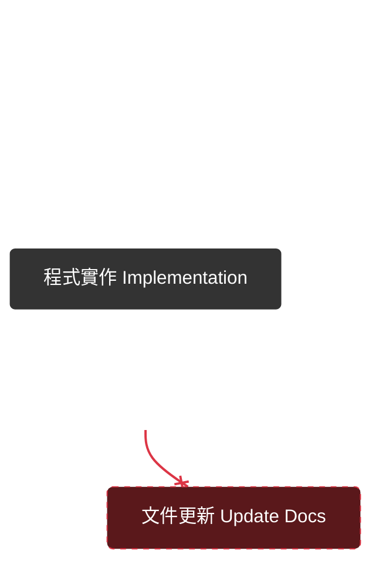
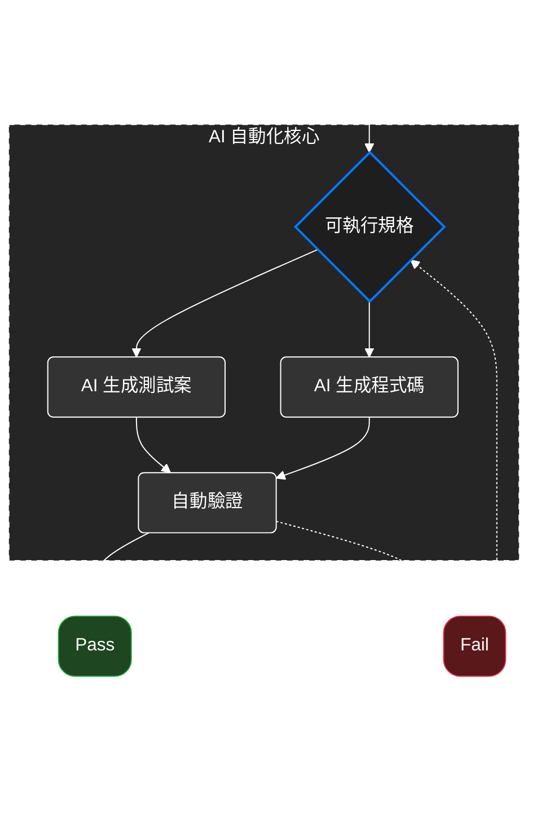

# Spec-Driven Development

一套方法論。 是一種把規格變成開發和新產物的軟體開發方法。

## 開發流程

### 傳統開發

> 程式碼才是唯一真相

### SDD

需求輸入 -> 可執行規格 -> AI 生成測試與程式碼 -> 自動驗證與部署

> 程式碼由規格生成，更新規格即可再生實作，讓規格變成為可執行的文件

## 核心理念

- 意圖導向開發 
  開發者先定義意圖，做什麼(what)，再決定怎麼做(how)
- 豐富規格撰寫 
  結合防呆機制和組織原則
- 多步驟的精練 
  透過一步一步引導來產出高品質的 SDD
- **高度依賴先進 AI 模型對規格的解讀能力** 
  先進的模型直接影響產出的品質。
